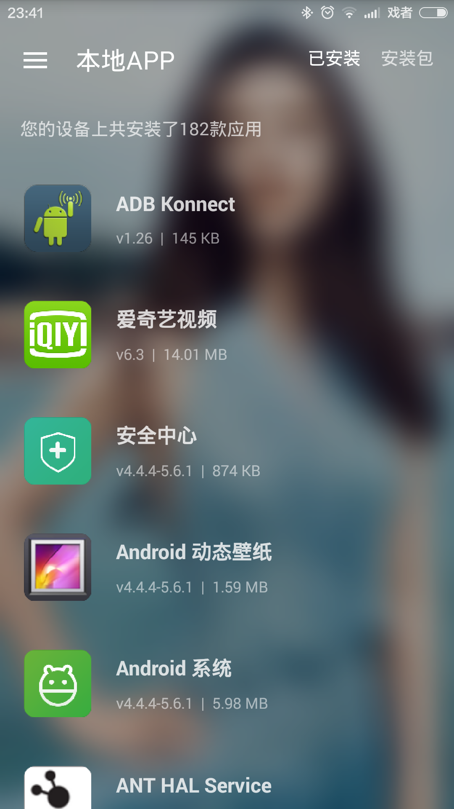

Sketch支持直接读取APK文件的图标，如下：
```java
// SketchImageView
SketchImageView sketchImageView = ...;
sketchImageView.displayImage("/sdcard/google_play.apk");

// display
Sketch.with(context).display("/sdcard/google_play.apk", sketchImageView).commit();

// load
Sketch.with(context).load("/sdcard/google_play.apk", new LoadListener(){
	...
}).commit();
```

Sketch还支持读取已安装APP的图标，如下：
```java
// SketchImageView
SketchImageView sketchImageView = ...;
sketchImageView.displayInstalledAppIcon("com.tencent.qq", 50001);

// display
Sketch.with(context).displayInstalledAppIcon("com.tencent.qq", 50001, sketchImageView).commit();

// load
Sketch.with(context).loadInstalledAppIcon("com.tencent.qq", 50001, new LoadListener(){
	...
}).commit();
```


