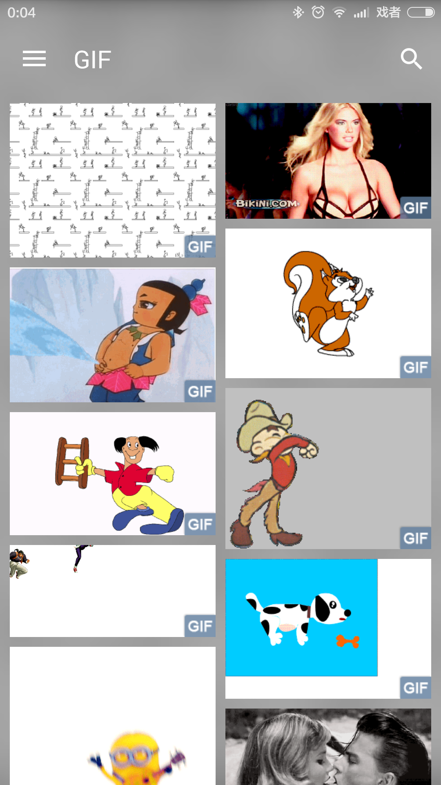

Sketch集成了android-gif-drawable 1.2.6，可以无障碍的播放gif图片

#### 配置解码GIF图
Sketch默认不解码gif图，只会通过BitmapFactory读取其第一帧作为一个普通的图片

你可以通过Options.setDecodeGifImage(true)或Helper.decodeGifImage()明确指明可以播放才会使用GifDrawable解码gif图：

```
sketImageView.getOptions().setDecodeGifImage(true);
```
属性配置请参考[配置各种属性.md](options.md)

注意：
>* Sketch会根据mimeType判断是否是gif图，因此不用担心识别不了伪装成jpg的gif图
>* GifDrawable不能使用maxSize、resize、TransitionImageDisplayer
>* GifDrawable还不能使用内存缓存，因为GifDrawable需要依赖Callback才能播放，
如果缓存的话就会出现一个GifDrawable被显示在多个ImageView上的情况，这时候就只有最后一个能正常播放

#### 显示gif图标识
Sketch支持解码gif图，因此SketchImageView在发现显示的是gif图的时候可以在SketchImageView的右下角显示一个图标，以告诉用户这是一张gif图，如下：

```java
sketchImageView.setShowGifFlagEnabled(R.drawable.ic_gif);
```

Sketch通过mimeType来识别gif图，所以即使你没有调用decodeGifImage()也会认为这是一张gif图，这个功能主要用来在列表中告诉用户这是一张gif图，然后点击图片到大图详情页再播放gif

效果如下：



#### 配置点击播放gif

在列表中显示gif的时候可以默认不自动播放，然后显示一个播放图标，用户点击后开始播放，如下开启功能即可：

```java
sketchImageView.setClickPlayGifEnabled(R.drawable.ic_video_play);
```

#### 页面不可见时停止播放
GifDrawable默认是自动播放的，如果你在ViewPager中连续的显示多张gif的话，最少会有三张GIF同时在播放，但我们同一时间只能看到一张，因此需要控制只有页面显示的时候才播放gif

SketchGifDrawable提供了followPageVisible(boolean userVisible, boolean fromDisplayCompleted)方法来帮助你方便的实现此功能

在Fragment中实现如下：

```java
imageView.setDisplayListener(new DisplayListener() {
    ...

    @Override
    public void onCompleted(Drawable drawable, ImageFrom imageFrom, ImageAttrs imageAttrs) {
        // 显示完成，isResumed() && getUserVisibleHint()为true页面可见，否则不可见
        Drawable lastDrawable = SketchUtils.getLastDrawable(imageView.getDrawable());
        if (lastDrawable != null && (lastDrawable instanceof SketchGifDrawable)) {
            ((SketchGifDrawable) lastDrawable).followPageVisible(isResumed() && getUserVisibleHint(), true);
        }
    }
});

@Override
public void onResume() {
    super.onResume();

    // 页面可见
    if (getUserVisibleHint()) {
        Drawable lastDrawable = SketchUtils.getLastDrawable(imageView.getDrawable());
        if (lastDrawable != null && (lastDrawable instanceof SketchGifDrawable)) {
            ((SketchGifDrawable) lastDrawable).followPageVisible(true, false);
        }
    }
}

@Override
public void onPause() {
    super.onPause();

    // 页面不可见
    if (getUserVisibleHint()) {
        Drawable lastDrawable = SketchUtils.getLastDrawable(imageView.getDrawable());
        if (lastDrawable != null && (lastDrawable instanceof SketchGifDrawable)) {
            ((SketchGifDrawable) lastDrawable).followPageVisible(false, false);
        }
    }
}

@Override
public void setUserVisibleHint(boolean isVisibleToUser) {
    super.setUserVisibleHint(isVisibleToUser);

    // isVisibleToUser为true页面可见，否则不可见
    if (isResumed()) {
        Drawable lastDrawable = SketchUtils.getLastDrawable(imageView.getDrawable());
        if (lastDrawable != null && (lastDrawable instanceof SketchGifDrawable)) {
            ((SketchGifDrawable) lastDrawable).followPageVisible(isVisibleToUser, false);
        }
    }
}
```

详情请参考[ImageFragment](../../sample/src/main/java/me/xiaopan/sketchsample/fragment/ImageFragment.java)的第 142 行和第 293 行

在Activity中的实现如下：

```java
private boolean resumed;

imageView.setDisplayListener(new DisplayListener() {
    ...

    @Override
    public void onCompleted(Drawable drawable, ImageFrom imageFrom, ImageAttrs imageAttrs) {
        // 显示完成，resumed为true页面可见，否则不可见
        Drawable lastDrawable = SketchUtils.getLastDrawable(imageView.getDrawable());
        if (lastDrawable != null && (lastDrawable instanceof SketchGifDrawable)) {
            ((SketchGifDrawable) lastDrawable).followPageVisible(resumed, true);
        }
    }
});

@Override
public void onResume() {
    super.onResume();

    resumed = true;

    // 页面可见
    Drawable lastDrawable = SketchUtils.getLastDrawable(imageView.getDrawable());
    if (lastDrawable != null && (lastDrawable instanceof SketchGifDrawable)) {
        ((SketchGifDrawable) lastDrawable).followPageVisible(true, false);
    }
}

@Override
public void onPause() {
    super.onPause();

    resumed = false;

    // 页面不可见
    Drawable lastDrawable = SketchUtils.getLastDrawable(imageView.getDrawable());
    if (lastDrawable != null && (lastDrawable instanceof SketchGifDrawable)) {
        ((SketchGifDrawable) lastDrawable).followPageVisible(false, false);
    }
}
```
