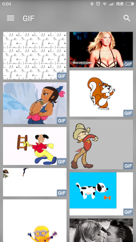

# 播放 GIF 图片

Sketch 集成了 [android-gif-drawable]，可以无障碍的播放 gif 图片

### 配置依赖

添加 sketch-gif 的依赖

```groovy
implementation 'me.panpf:sketch-gif:$sketch_gif_version'
```

请自行替换 `$sketch_gif_version` 为最新的版本 [![sketch_gif_version_image]][sketch_gif_version_link]

### 配置播放 GIF 图

Sketch 默认不播放 gif 图，只会通过 BitmapFactory 读取其第一帧作为一个普通的图片，需要你主动开启解码 gif 图片功能才会播放 gif，如下：

```java
// SketchImageView
sketImageView.getOptions().setDecodeGifImage(true);

// Helper
Sketch.with(context).display(imageUri, sketchImageView)
    .decodeGifImage()
    .commit();
```

注意：
* Sketch 会根据 mimeType 判断是否是 gif 格式，因此不用担心识别不了后缀名伪装成 jpg 的 gif 图片
* [GifDrawable] 不能使用 [MaxSize]、[Resize]、[TransitionImageDisplayer]
* [GifDrawable] 还不能使用内存缓存，因为 [GifDrawable] 需要依赖 Callback 才能播放，如果缓存的话就会出现一个 [GifDrawable] 被显示在多个 ImageView 上的情况，这时候就只有最后一个能正常播放

### 显示 gif 图标识

SketchImageView 支持在右下角显示一个图标提示用户这是一张 gif 图，效果如下：



即使你没有配置 decodeGifImage 属性也会显示 gif 标识，这个功能主要用来在列表中提示用户这是一张 gif 图片

你只需开启即可，如下：

```java
sketchImageView.setShowGifFlagEnabled(R.drawable.ic_gif);
```

### 点击播放 gif

在列表中显示 gif 的时候可以默认不自动播放，然后显示一个播放图标，用户点击后开始播放，如下开启即可：

```java
sketchImageView.setClickPlayGifEnabled(R.drawable.ic_video_play);
```

### 页面不可见时停止播放

[GifDrawable] 是自动播放的，如果你在 ViewPager 中连续的显示多张 gif 的话，最少会有三张 GIF 同时在播放，但同一时间只能看到一张，因此需要控制只有页面显示的时候才播放 gif

Sketch 会将 [GifDrawable] 包装成 [SketchGifDrawable]， [SketchGifDrawable] 提供了 followPageVisible(boolean, boolean) 方法来帮助你实现此功能页面不可见时停止播放，可见时恢复播放的功能

在 Fragment 中实现如下：

```java
imageView.setDisplayListener(new DisplayListener() {
    ...

    @Override
    public void onCompleted(Drawable drawable, ImageFrom imageFrom, ImageAttrs imageAttrs) {
        // 显示完成，isResumed() && getUserVisibleHint() 为 true 页面可见，否则不可见
        Drawable lastDrawable = SketchUtils.getLastDrawable(imageView.getDrawable());
        if (lastDrawable != null && (lastDrawable instanceof SketchGifDrawable)) {
            ((SketchGifDrawable) lastDrawable).followPageVisible(isResumed() && getUserVisibleHint(), true);
        }
    }
});

@Override
public void onResume() {
    super.onResume();

    // 页面可见
    if (getUserVisibleHint()) {
        Drawable lastDrawable = SketchUtils.getLastDrawable(imageView.getDrawable());
        if (lastDrawable != null && (lastDrawable instanceof SketchGifDrawable)) {
            ((SketchGifDrawable) lastDrawable).followPageVisible(true, false);
        }
    }
}

@Override
public void onPause() {
    super.onPause();

    // 页面不可见
    if (getUserVisibleHint()) {
        Drawable lastDrawable = SketchUtils.getLastDrawable(imageView.getDrawable());
        if (lastDrawable != null && (lastDrawable instanceof SketchGifDrawable)) {
            ((SketchGifDrawable) lastDrawable).followPageVisible(false, false);
        }
    }
}

@Override
public void setUserVisibleHint(boolean isVisibleToUser) {
    super.setUserVisibleHint(isVisibleToUser);

    // isVisibleToUser 为 true 页面可见，否则不可见
    if (isResumed()) {
        Drawable lastDrawable = SketchUtils.getLastDrawable(imageView.getDrawable());
        if (lastDrawable != null && (lastDrawable instanceof SketchGifDrawable)) {
            ((SketchGifDrawable) lastDrawable).followPageVisible(isVisibleToUser, false);
        }
    }
}
```

详情请参考示例 APP 的 [ImageFragment] 的第 142 行和第 293 行

在 Activity 中的实现如下：

```java
private boolean resumed;

imageView.setDisplayListener(new DisplayListener() {
    ...

    @Override
    public void onCompleted(Drawable drawable, ImageFrom imageFrom, ImageAttrs imageAttrs) {
        // 显示完成，resumed为true页面可见，否则不可见
        Drawable lastDrawable = SketchUtils.getLastDrawable(imageView.getDrawable());
        if (lastDrawable != null && (lastDrawable instanceof SketchGifDrawable)) {
            ((SketchGifDrawable) lastDrawable).followPageVisible(resumed, true);
        }
    }
});

@Override
public void onResume() {
    super.onResume();

    resumed = true;

    // 页面可见
    Drawable lastDrawable = SketchUtils.getLastDrawable(imageView.getDrawable());
    if (lastDrawable != null && (lastDrawable instanceof SketchGifDrawable)) {
        ((SketchGifDrawable) lastDrawable).followPageVisible(true, false);
    }
}

@Override
public void onPause() {
    super.onPause();

    resumed = false;

    // 页面不可见
    Drawable lastDrawable = SketchUtils.getLastDrawable(imageView.getDrawable());
    if (lastDrawable != null && (lastDrawable instanceof SketchGifDrawable)) {
        ((SketchGifDrawable) lastDrawable).followPageVisible(false, false);
    }
}
```

[README]: ../../README.md
[sketch_gif_version_image]: https://api.bintray.com/packages/panpf/maven/sketch-gif/images/download.svg
[sketch_gif_version_link]: https://bintray.com/panpf/maven/sketch-gif/_latestVersion#files
[android-gif-drawable]: https://github.com/koral--/android-gif-drawable
[GifDrawable]: ../../sketch-gif/src/main/java/pl/droidsonroids/gif/GifDrawable.java
[MaxSize]: ../../sketch/src/main/java/me/panpf/sketch/request/MaxSize.java
[Resize]: ../../sketch/src/main/java/me/panpf/sketch/request/Resize.java
[TransitionImageDisplayer]: ../../sketch/src/main/java/me/panpf/sketch/display/TransitionImageDisplayer.java
[SketchImageView]: ../../sketch/src/main/java/me/panpf/sketch/SketchImageView.java
[SketchGifDrawable]: ../../sketch/src/main/java/me/panpf/sketch/drawable/SketchGifDrawable.java
[ImageFragment]: ../../sample/src/main/java/me/panpf/sketchsample/fragment/ImageFragment.kt
